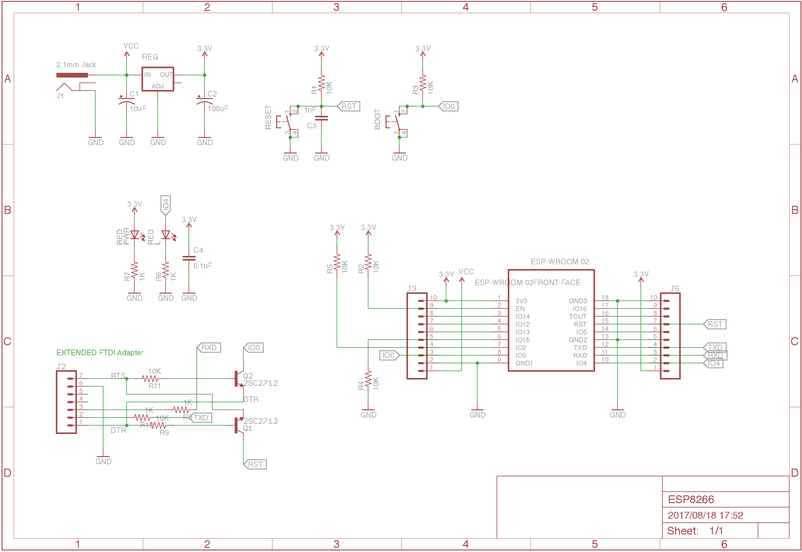
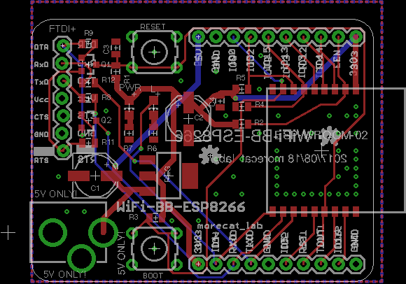

# ESP8266-BB

## 1. Introduction

**ESP8266-BB** (Bearbone) is yet another ESP-8266 based development board. 
For the programming of the board, an *extended 7-pin FTDI adapter* is required.

## 2. Schematic

## 3. Board layout

## 4. BOM

|     Name   |          Parts                    |   Value                 |
|  :-------: | :-------------------------------: | :---------------------: |
|     U1     |  3.3V Low voltage drop Regulator  | LM1117-3.3              | 
|     U2     |  ESP-WROOM-02                     | -                       | 
|  LED1,LED2 |  LED1 (Green)  LED2(RED)          | (1608 size)             | 
|     J1     |  2.1mm power Jack                 | Power in                | 
|     J2     |  7 pin                            | L-angle connector       | 
|   J3,J4    |  10Pin receptacle                 | pin header is ok        | 
|  SW1,SW2   |  Tactile Switch                   | Alps SKHH or equivalent | 
|   Q1,Q2    |  NPN-TR                           | (2SC2712)               | 
|   R1-R5    |  Carbon Register                  | 10K Ohm 1/10W(1608)     | 
|   R6,R7    |  Carbon Register                  | 1K Ohm 1/10W(1608)      | 
|   R9,R11   |  Carbon Register                  | 10K Ohm 1/10W(1608)     | 
|   R8,R12   |  Carbon Register                  | 1K Ohm 1/10W(1608)      | 
|     C1     |  Electrolytic  Capacitor          | 10uF / 10V or better    |
|     C2     |  Electrolytic  Capacitor          | 100uF / 10V or better   |
|     C3     |  Multilayer Ceramic  Capacitor    | 0.01uF / 10V (1608)     |
|     C4     |  Multilayer Ceramic  Capacitor    | 0.1uF / 10V (1608)      |

## EOF